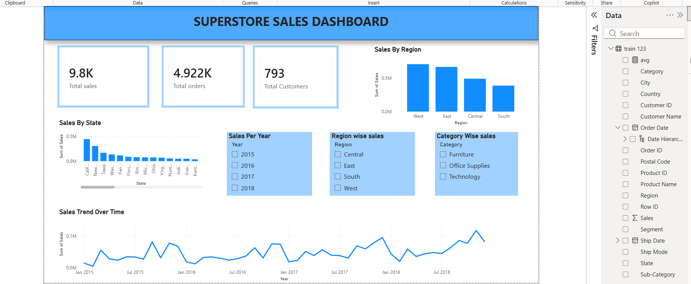
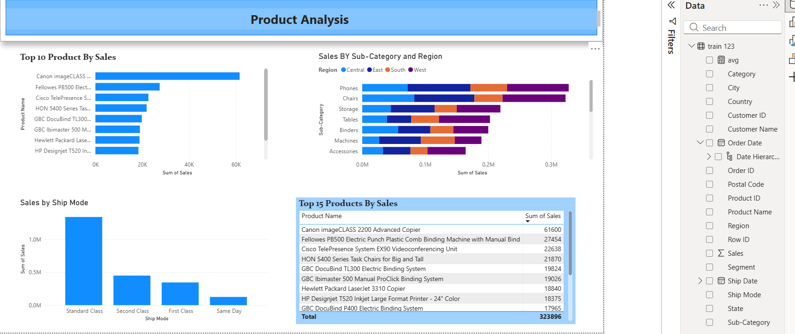

 # 📊 Super Sales Dashboard (Power BI Project)

## 📌 Project Overview
This project is a Power BI sales dashboard created to analyze business sales performance, profit, and key insights. It helps in visualizing data and making better business decisions.

---

## 🛠 Tools Used
- Power BI  
- Excel (Data Source)  
- Data Visualization  

---

## 📈 Key Insights
- Sales and profit analysis  
- Region-wise performance tracking  
- Category-wise breakdown  
- Interactive filters (slicers) for dynamic insights  

---

## 🎯 Objective
The goal of this project is to convert raw sales data into meaningful insights using interactive dashboards.

---

## 📷 Dashboard Preview

### Screenshot 1

### Screenshot 2

### Screenshot 3

---

## 👩‍💻 Author
Tanvi Pandey
---

## ⭐ Note
This project is for learning and portfolio purposes.
